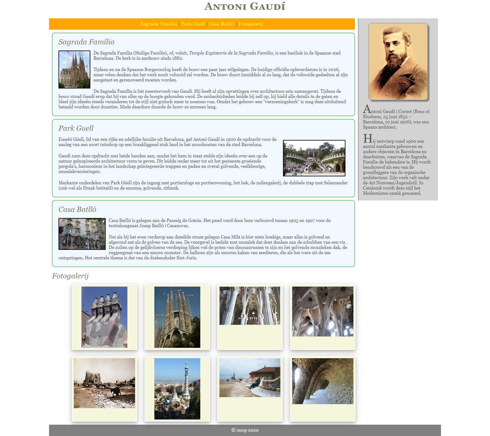
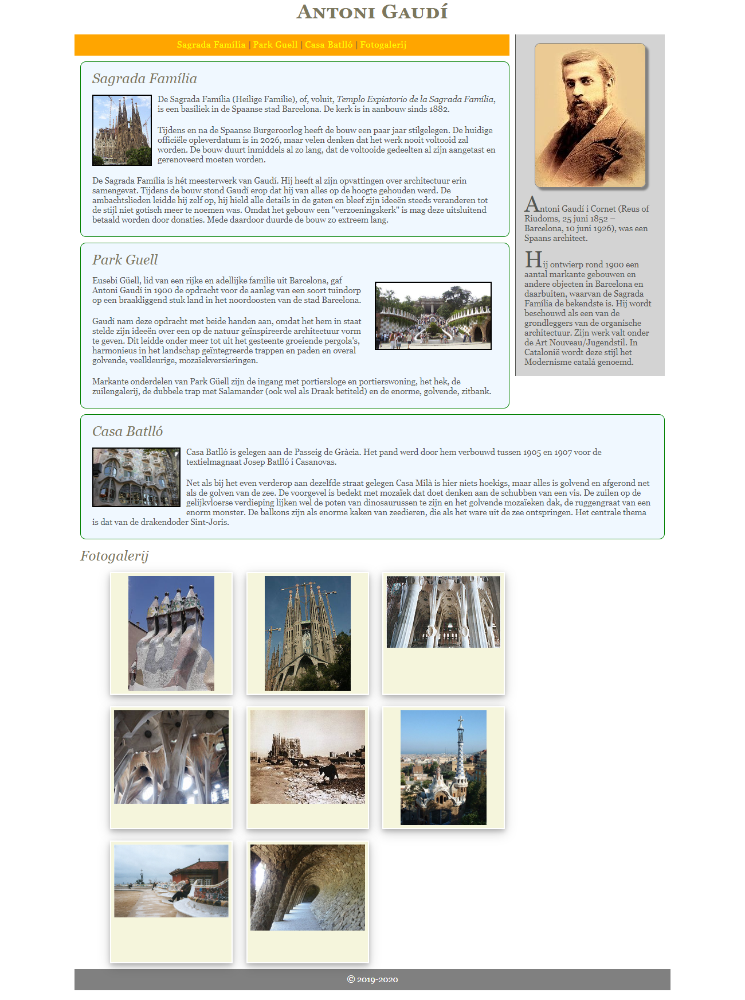

# oe-positionering-gaudi
Oefening maak Css vertrekkende van HTML-Pagina

# Opzet
Je krijgt ditmaal een RootFolder aangeleverd, maar de CSS ontbreekt. De bedoeling is dat je op basis van wat je tot hiertoe aanleerde de webpagina vormgeeft.

> ## Tips
> - Gebruikt lettertype : georgia
> - Voor de fotogalery is het misschien aangeraden iets met display te doen

## Op een andere resolutie

